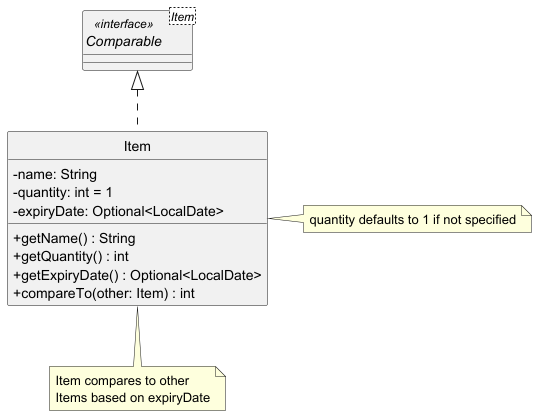
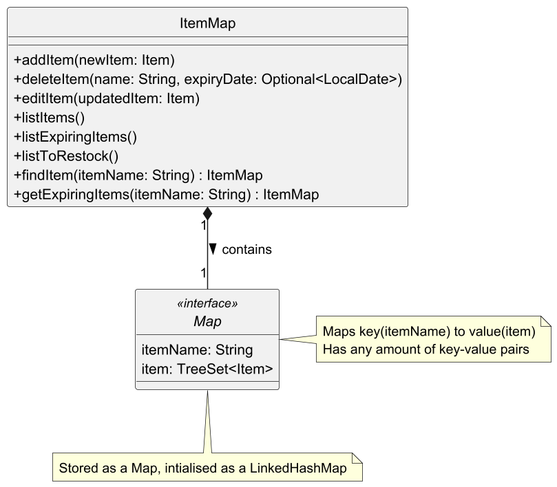

# Developer Guide

## Table of Contents

- [Developer Guide](#developer-guide)
    - [Table of Contents](#table-of-contents)
    - [Acknowledgements](#acknowledgements)
    - [Design \& Implementation](#design--implementation)
        - [UI and I/O](#ui-and-io)
        - [Commands](#commands)
        - [Storage](#storage)
        - [Item and ItemMap](#item-and-itemmap)
        - [DateTime](#datetime)
        - [Exceptions and Logging](#exceptions-and-logging)
    - [Product scope](#product-scope)
        - [Target user profile](#target-user-profile)
        - [Value proposition](#value-proposition)
    - [User Stories](#user-stories)
    - [Non-Functional Requirements](#non-functional-requirements)
    - [Glossary](#glossary)
    - [Instructions for Testing](#instructions-for-testing)
        - [Manual Testing](#manual-testing)
        - [JUnit Testing](#junit-testing)
        - [Text UI Testing](#text-ui-testing)
    - [Future Enhancements](#future-enhancements)

## Acknowledgements

{list here sources of all reused/adapted ideas, code, documentation, and third-party libraries -- include links to the
original source as well}

## Design & implementation

{Describe the design and implementation of the product. Use UML diagrams and short code snippets where applicable.}

<!-- @@author cxc0418 -->

### UI and I/O

The program uses a command-line interface (CLI) for interaction with the user.
It receives input as text commands, processes these commands, and provides feedback through the console.

### Commands

Each user action (e.g. adding, deleting, or editing an item) is mapped to a specific command class.
These classes handle the logic for interpreting the input and calling the appropriate methods from the ItemMap and
Storage classes.

Example:

```
AddItemCommand command = new AddItemCommand(itemName, quantity, expiryDate);
command.execute(itemMap, storage);
```

<!-- @@author yakultbottle -->

### Storage

**API**: Storage.java

Entries are stored in Comma Separated Values(CSV) format. Fields read from left
to right are: **Item type**, **Quantity**, and **Expiry date**(optional). Items
may or may not have an expiry date, but all possess an Item type and a Quantity.

Example of stored entries:

```
panadol,1
panadol,30,2024-08-03
panadol,20,2024-08-09
bandage,34
```

The Storage class depends on self-defined classes PillException, Item, and
ItemMap. While it has other dependencies, such as File and FileWriter from
the Java standard library, PillException is the only custom class it depends on.

### Item and ItemMap

The Item class has three private variables, a name, a quantity, and an
expiry date. An Item may or may not have an expiry date, so we store it
as an Optional, which handles empty values for us without using null. 



Quantity will always be a positive integer, and if no quantity is specified
in the constructor, the default value is 1. Similarly, if no value is provided
for expiry date, then it will be an Optional.empty().

The ItemMap class contains a key-value pair, implemented as a Map, from the
item name(String) to the item(TreeSet\<Item>)



Each TreeSet\<Item> represents an item type, with each entry in the TreeSet
having a unique expiry date. The TreeSet then orders Items based on the
compareTo method overridden in the Item class, which sorts by the earliest
expiry date to the latest. Items with no expiry date, aka an expiry date of
Optional.empty(), will be the last entry in the TreeSet. 

The usage of TreeSet is to facilitate storing multiple batches of items with
different expiry dates and quantities, and to be able to extract items with the
soonest expiry date when taking out of storage. 

<!-- @@author -->

## Product scope

### Target user profile

Pharmacy Inventory & Logistics Ledger (PILL) is designed for personnel responsible for managing and monitoring
pharmaceutical inventories. Target users include pharmacists, pharmacy cashiers, logistics in-charge personnel, and
regional managers in pharmacies or healthcare facilities, particularly those who prefer a command-line interface (CLI)
for its efficiency and simplicity.

### Value proposition

PILL provides a streamlined, user-friendly command-line interface (CLI) to manage pharmaceutical inventory with ease.
This minimalistic tool facilitates quick and efficient inventory operations, tailored to the requirements of pharmacy
staff and logistics managers who need to track stock, monitor expiry dates, and generate reports without unnecessary
complexity.

## User Stories

| Version | As a ...            | I want to ...                             | So that I can ...                                            |
|---------|---------------------|-------------------------------------------|--------------------------------------------------------------|
| v1.0    | new user            | see usage instructions                    | refer to them when I forget how to use the application       |
| v1.0    | pharmacist          | add new medicine stock                    | keep track of new arrivals                                   |
| v1.0    | pharmacy cashier    | remove items from stock                   | remove them from the record when they run out                |
| v1.0    | logistics in-charge | list out all medicines currently stocked  | get an overview of what the pharmacy has at the moment       |
| v1.0    | regional manager    | export all items as a human readable file | compare across multiple outlets                              |
| v1.0    | frequent user       | find items provided a keyword             | find relevant items without having to look through all items |
| v2.0    | logistics in-charge | list all expiring items                   | remember to clear them out                                   |
| v2.0    | logistics in-charge | list all items that need to be restocked  | place orders before items run out                            |

## Non-Functional Requirements

{Give non-functional requirements}

## Glossary

* *glossary item* - Definition

## Instructions for manual testing

{Give instructions on how to do a manual product testing e.g., how to load sample data to be used for testing}
